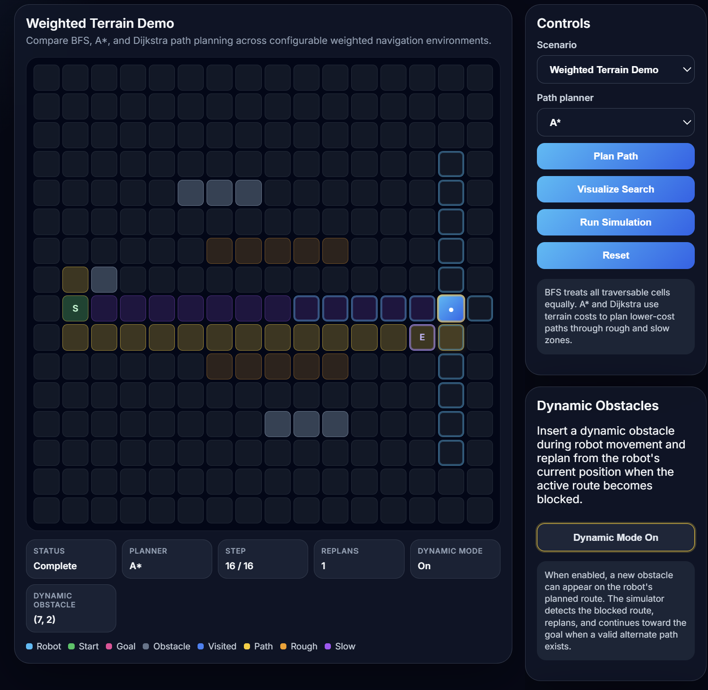
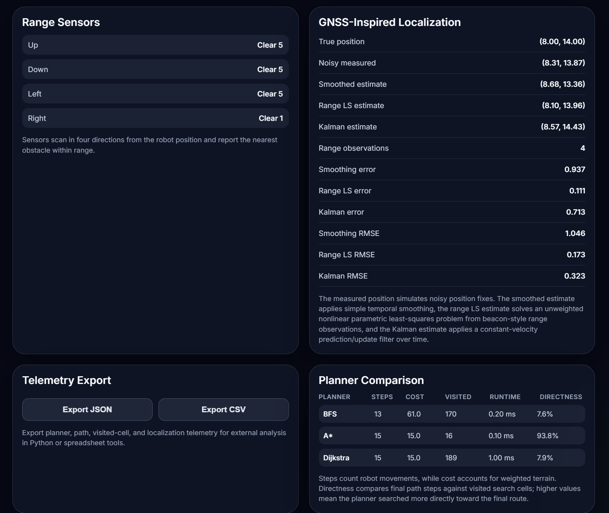

# Autonomy Simulation Lab


**Live Demo:** https://kushrishi.github.io/autonomy-simulation-lab/

**Latest Release:** [v1.0.0 - Autonomy Simulation Lab](https://github.com/Kushrishi/autonomy-simulation-lab/releases/tag/v1.0.0)

**License:** MIT

An interactive robotics and autonomy simulation project focused on robot navigation, path planning, search visualization, dynamic replanning, sensor simulation, GNSS-inspired localization, telemetry export, and offline analysis.

This project is designed as a portfolio-focused engineering system for autonomy, navigation, and robotics software. It starts with a browser-based robot navigation simulator and expands into weighted planning, dynamic obstacles, sensor telemetry, range-based localization, and state-estimation concepts.

## Simulator Preview



The simulator cockpit shows weighted path planning, dynamic obstacle replanning, compact telemetry, and robot navigation state in one view.



The analysis dashboard shows range sensor output, GNSS-inspired localization, nonlinear range least-squares estimation, Kalman filtering, telemetry export, and planner comparison metrics.

## System Overview

```text
Scenario + Terrain + Obstacles
        |
        v
Path Planner: BFS / A* / Dijkstra
        |
        v
Search Visualization + Final Path
        |
        v
Robot Animation + Dynamic Replanning
        |
        +--> Range Sensor Simulation
        |
        +--> GNSS-Inspired Localization
        |       +--> Noisy Position Fixes
        |       +--> Nonlinear Range Least Squares
        |       +--> Constant-Velocity Kalman Filter
        |
        +--> Telemetry Export + Python Analysis
```

## Current Version

The v1.0.0 release implements a visual grid-based autonomy simulator using React, TypeScript, Vite, and Vitest.

The simulator includes:

* 2D grid-based robot navigation
* Multiple configurable navigation scenarios
* Interactive scenario editing
* Start and goal position placement
* Obstacle placement and removal
* Rough and slow weighted terrain cells
* Custom scenario export and import using JSON files
* Breadth-first search path planning
* A* path planning with Manhattan distance
* Dijkstra path planning for weighted terrain
* Binary min-priority queue optimization for A* and Dijkstra
* Planner selection between BFS, A*, and Dijkstra
* Animated search expansion visualization
* Final path visualization
* Animated robot movement
* Dynamic obstacle insertion during robot movement
* Replanning from the robot's current position when the active route becomes blocked
* Compact telemetry strip below the simulator grid
* Live telemetry metrics panel
* Cost-aware planner comparison dashboard
* Four-direction range sensor simulation
* Sensor ray visualization
* Obstacle hit highlighting
* Sensor telemetry panel
* GNSS-inspired noisy localization simulation
* Beacon-style range observations
* Nonlinear range least-squares position estimation
* Constant-velocity Kalman localization filter
* True, measured, smoothed, range LS, and Kalman position tracking
* Localization error metrics including RMSE
* Telemetry export to JSON and CSV
* Python analysis scripts for exported telemetry
* Automated validation tests for planner, localization, priority queue, scenario import, dynamic obstacle, and estimation behavior
* GitHub Actions CI for automated test and build validation
* GitHub Pages deployment for a live browser demo
* MIT license and v1.0.0 release packaging

## Demo Scenarios

The simulator currently supports multiple test environments:

* Warehouse Navigation Demo
* Maze Navigation Demo
* Obstacle Course Demo
* Weighted Terrain Demo

These scenarios allow BFS, A*, and Dijkstra to be tested across different obstacle layouts, terrain-cost patterns, dynamic replanning conditions, and navigation behaviors.

The **Weighted Terrain Demo** is especially useful for comparing shortest-step planning against terrain-cost-aware planning and for testing dynamic obstacle replanning.

## Interactive Scenario Editor

The simulator includes an interactive scenario editor that allows users to modify the navigation environment directly from the browser.

Editor tools include:

* Start position placement
* Goal position placement
* Obstacle placement and removal
* Rough terrain placement and removal
* Slow terrain placement and removal
* Cell clearing

The editor also supports custom scenario import and export. Users can export an edited scenario as a JSON file, then import it later to reload the same custom environment.

When the grid is edited or a custom scenario is imported, stale path, search, telemetry, dynamic obstacle, and localization state are reset so that new planner runs reflect the updated scenario.

## Path Planning

The project currently supports three path-planning algorithms.

### Breadth-First Search

BFS explores the grid outward from the start position and finds the shortest path by number of steps in an unweighted grid.

In this simulator, BFS treats all traversable cells equally, so it does not optimize for terrain cost. BFS is useful for demonstrating complete search behavior, but it can explore many cells before reaching the goal.

### A* Search

A* uses Manhattan distance as a heuristic to prioritize cells that appear closer to the goal.

In this project, A* uses terrain-aware movement cost for accumulated path cost and Manhattan distance for goal-directed search. This allows A* to find low-cost paths while often visiting fewer cells than Dijkstra.

A* uses a binary min-priority queue to efficiently select the next lowest-score candidate cell from the open set.

### Dijkstra Search

Dijkstra search computes the lowest-cost path through the grid using accumulated terrain movement cost.

Unlike BFS, Dijkstra accounts for rough and slow terrain. Unlike A*, it does not use a heuristic, so it can explore more cells while still finding the lowest-cost route.

Dijkstra also uses the shared binary min-priority queue implementation.

## Weighted Terrain

The simulator supports weighted terrain cells:

* Normal terrain: standard movement cost
* Rough terrain: increased movement cost
* Slow terrain: high movement cost

BFS ignores terrain cost during planning, while A* and Dijkstra use terrain costs to find lower-cost routes.

The Weighted Terrain Demo is designed to show the difference between shortest-step planning and lowest-cost planning.

## Dynamic Obstacle Replanning

The simulator supports dynamic obstacle behavior during robot movement.

When Dynamic Mode is enabled:

1. The robot starts moving along the active planned path.
2. A new obstacle is inserted on the active route.
3. The simulator detects that the next route segment is blocked.
4. The selected planner replans from the robot's current position.
5. The robot continues to the goal if an alternate route exists.
6. Telemetry updates the replan count and dynamic obstacle coordinate.

This demonstrates a more realistic autonomy behavior than static path planning because the robot can respond to a changing environment.

## Planner Comparison

The simulator includes a planner comparison dashboard showing:

* Algorithm name
* Path steps
* Path cost
* Nodes visited
* Runtime
* Search directness

Path steps count robot movements from start to goal. Path cost accounts for weighted terrain. Search directness compares final path steps against visited search cells; higher values indicate that the planner searched more directly toward the final route.

## Sensor Simulation

The simulator includes a simple four-direction range sensor system.

The robot scans:

* Up
* Down
* Left
* Right

Each sensor reports whether an obstacle is detected within range and how far away it is. Sensor rays are visualized on the grid, and detected obstacles are highlighted.

This introduces a robotics-style sensing layer beyond basic path planning.

## GNSS-Inspired Localization

The simulator includes a GNSS-inspired localization layer.

During robot movement, the system tracks:

* True robot position
* Noisy measured position
* Smoothed estimated position
* Range least-squares estimated position
* Kalman estimated position
* Range observations from fixed beacons
* Current localization error
* Average localization error
* Maximum localization error
* RMSE metrics

The localization model includes several estimation approaches.

### Noisy Position Fixes

The measured position simulates noisy position observations around the robot's true grid position.

### Smoothed Estimate

The smoothed estimate applies simple temporal smoothing to noisy position fixes. This provides a basic baseline for reducing measurement noise.

### Range Least-Squares Estimate

The range LS estimate uses beacon-style range observations from fixed beacon positions around the grid.

The range model is an unweighted nonlinear parametric least-squares problem. The unknowns are the robot's row and column position, and the observations are noisy ranges to fixed beacons.

The solver uses iterative Gauss-Newton updates to estimate position from range residuals.

### Kalman Estimate

The Kalman estimate applies a linear constant-velocity prediction/update filter to noisy position fixes.

The state vector is:

```text
[row, col, row_velocity, col_velocity]
```

This is a standard linear Kalman filter for position measurements. It is not an extended Kalman filter and does not directly fuse nonlinear range observations.

### Localization Scope

This is a GNSS-inspired educational model, not a full production GNSS receiver.

The current simulator intentionally omits real-world GNSS complexities such as satellite ephemerides, receiver clock bias, atmospheric delay, multipath, cycle slips, carrier phase ambiguity, satellite geometry dilution, and covariance-weighted measurement modeling.

A future extension could add a range-based extended Kalman filter that directly fuses beacon-style range observations with a motion model.

## Telemetry Export

The simulator can export telemetry data to:

* JSON
* CSV

Exported telemetry includes planner information, path cells, visited cells, terrain-aware path cost, runtime metrics, robot trajectory data, and localization samples.

This allows the browser simulation to connect with external analysis tools.

## Python Analysis

The project includes Python scripts for analyzing exported telemetry.

The analysis tools can generate plots for:

* Robot trajectory
* Localization error over time
* Planner comparison metrics

This adds an offline data-analysis workflow similar to how robotics, autonomy, and navigation systems are often evaluated.

## Testing and Validation

The project includes automated validation tests using Vitest.

Current tests verify that:

* BFS, A*, and Dijkstra find correct paths on normal terrain
* BFS ignores terrain cost while A* and Dijkstra optimize weighted terrain cost
* A* matches Dijkstra on weighted-cost optimality
* Planners fail cleanly when the goal is blocked
* The min-priority queue dequeues nodes in correct priority order
* Priority queue tie-breaking behaves deterministically
* Dynamic obstacle helper behavior is deterministic and testable
* Scenario import validation accepts valid JSON and rejects malformed inputs
* Localization samples are generated correctly
* RMSE is calculated consistently from localization error values
* Range observations are generated for localization samples
* Zero-noise range observations recover the true position
* Range residuals are computed consistently
* Noisy range estimates remain finite and reasonable
* The Kalman filter initializes correctly
* The Kalman filter updates toward new measurements
* The Kalman filter learns velocity from repeated position updates

GitHub Actions automatically runs validation tests and production build checks on pushes and pull requests.

## How It Works

The simulator represents the robot environment as a grid. Each cell can represent empty space, an obstacle, rough terrain, slow terrain, the robot start position, the goal position, a visited search cell, a final path cell, a sensor scan cell, or a localized robot state.

The selected planner searches for a path from the start position to the goal while avoiding obstacles. Depending on the selected algorithm, the planner may optimize for shortest step count or lowest weighted terrain cost.

The application can show the result instantly or animate the search process step by step.

After a path is found, the robot can animate along the planned route while telemetry, sensor readings, localization estimates, and dynamic replanning state update in real time.

If Dynamic Mode is enabled, a new obstacle can appear on the active route. The simulator then replans from the robot's current position and continues if a valid alternate route exists.

## Current Tech Stack

* TypeScript
* React
* Vite
* CSS
* Vitest
* GitHub Actions
* GitHub Pages
* Python
* Pandas
* Matplotlib

## Running the Project

Install dependencies:

```bash
npm install
```

Run the development server:

```bash
npm run dev
```

Build the project:

```bash
npm run build
```

Run validation tests:

```bash
npm test
```

For Windows PowerShell users who encounter npm script execution restrictions, use `npm.cmd` instead:

```powershell
npm.cmd install
npm.cmd run dev
npm.cmd test
npm.cmd run build
```

The local development site uses the GitHub Pages base path:

```text
http://localhost:5173/autonomy-simulation-lab/
```

## Suggested Manual Demo

A good manual test sequence is:

1. Open the live demo or local development site.
2. Select **Weighted Terrain Demo**.
3. Select **A***.
4. Turn **Dynamic Mode On**.
5. Click **Run Simulation**.
6. Watch the robot encounter a dynamic obstacle and replan.
7. Confirm telemetry shows a replan count and dynamic obstacle coordinate.
8. Review the planner comparison dashboard.
9. Review the GNSS-inspired localization panel.

This demo shows weighted path planning, dynamic replanning, telemetry, range sensing, and localization in one scenario.

## Future Work

Future versions may add:

* Range-based extended Kalman filter
* More realistic range sensor noise
* Additional localization covariance metrics
* Improved robot motion visualization
* Expanded telemetry analysis notebooks
* C++ path-planning benchmark module
* Additional autonomy scenarios and stress tests
* More advanced sensor fusion and uncertainty visualization

## Portfolio Relevance

This project is intended to demonstrate skills relevant to:

* Robotics simulation
* Autonomous navigation
* Path planning
* Search algorithm visualization
* Weighted graph search
* Dynamic obstacle replanning
* Interactive simulation tooling
* Custom scenario import/export
* Sensor modeling
* GNSS/navigation-inspired systems
* Nonlinear least-squares estimation
* Kalman filtering
* Localization error analysis
* Telemetry and metrics
* Data export
* Python-based data analysis
* Algorithm validation
* Automated testing and CI
* Web deployment
* Engineering software architecture

## Engineering Notes

This project intentionally balances educational clarity with real autonomy concepts.

BFS, A*, and Dijkstra are implemented directly so their behavior can be visualized and validated. A* and Dijkstra use a shared binary min-priority queue to make the weighted planners more algorithmically realistic.

The localization system is also intentionally staged. It starts with noisy position fixes, adds basic smoothing, then adds range-based nonlinear least-squares estimation and a linear constant-velocity Kalman filter. This makes the limitations of each method visible and creates a foundation for future EKF-style range fusion.
