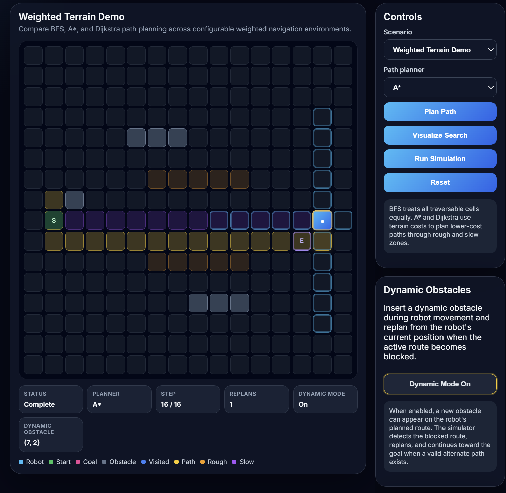
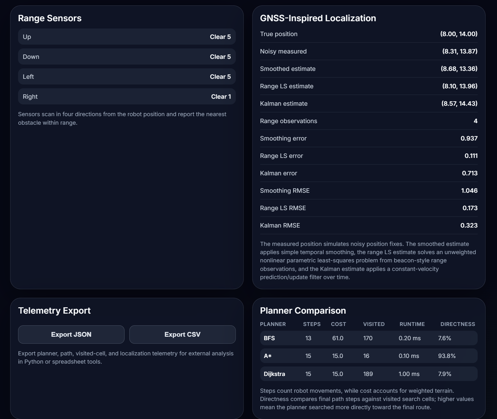

# Autonomy Simulation Lab


**Live demo:** https://kushrishi.github.io/autonomy-simulation-lab/  
**Release:** [v1.0.0](https://github.com/Kushrishi/autonomy-simulation-lab/releases/tag/v1.0.0)  
**License:** MIT

Autonomy Simulation Lab is a completed browser-based environment for path planning, dynamic replanning, noisy sensing, localization, state estimation, telemetry, and offline analysis.

The project combines classical planning algorithms with a deliberately simplified localization stack so that planning and estimation behavior can be inspected, compared, and tested in one interactive system.

## Preview





## System overview

```text
Scenario + terrain + obstacles
        |
        v
Planner: BFS / A* / Dijkstra
        |
        v
Search visualization + final path
        |
        v
Robot motion + dynamic replanning
        |
        +--> range sensing
        |
        +--> GNSS-inspired localization
        |       +--> noisy position fixes
        |       +--> nonlinear range least squares
        |       +--> constant-velocity Kalman filter
        |
        +--> telemetry export + Python analysis
```

## What is implemented

- 2D grid navigation with configurable scenarios and interactive editing
- BFS, A*, and Dijkstra planning
- terrain-weighted movement costs
- binary min-priority queue for A* and Dijkstra
- animated search and robot motion
- dynamic obstacle insertion and replanning from the robot's current state
- four-direction range sensing and obstacle-hit visualization
- GNSS-inspired noisy position measurements
- beacon-style range observations
- nonlinear Gauss-Newton range least-squares localization
- linear constant-velocity Kalman filtering
- localization error and RMSE metrics
- planner-comparison metrics
- JSON/CSV telemetry export
- Python analysis scripts for exported telemetry
- automated tests and GitHub Actions CI
- deployed GitHub Pages demo

## Planning

### BFS

Breadth-first search treats every traversable cell equally and finds the shortest path by step count on an unweighted grid. It is included as a simple baseline and intentionally ignores terrain cost.

### A*

A* uses terrain-aware accumulated movement cost with Manhattan distance as the heuristic. It uses a binary min-priority queue and is intended to find low-cost routes while typically exploring fewer cells than Dijkstra.

### Dijkstra

Dijkstra minimizes accumulated terrain cost without a heuristic. It uses the same priority-queue implementation as A* and provides the weighted-cost reference used in planner comparisons.

## Dynamic replanning

When Dynamic Mode is enabled, the simulator can insert a new obstacle on the active route while the robot is moving. If the next route segment becomes blocked, the selected planner replans from the robot's current position and continues when an alternate path exists.

## Localization and estimation

The localization layer tracks:

- true robot position
- noisy measured position
- simple smoothed estimate
- nonlinear range least-squares estimate
- Kalman-filtered estimate
- beacon-style range observations
- current, average, maximum, and RMSE localization error

The range least-squares solver estimates the robot's row/column position from noisy ranges to fixed beacons using iterative Gauss-Newton updates.

The Kalman filter uses the linear state

```text
[row, col, row_velocity, col_velocity]
```

with constant-velocity prediction and noisy position measurements.

### Scope

This is a GNSS-inspired educational localization model, not a GNSS receiver. It intentionally omits satellite ephemerides, receiver clock bias, atmospheric effects, multipath, carrier-phase ambiguities, cycle slips, satellite geometry, and covariance-weighted GNSS measurement models.

The Kalman implementation is a standard linear position/velocity filter; it does not directly fuse the nonlinear beacon-range observations.

## Validation

Automated tests cover the main algorithmic and estimation behavior, including:

- planner path correctness
- weighted-cost behavior
- A* agreement with Dijkstra on weighted optimality
- blocked-goal failure handling
- priority-queue ordering and deterministic tie breaking
- dynamic-obstacle helpers
- scenario import validation
- localization sample generation
- RMSE calculations
- range-observation generation and residuals
- zero-noise range recovery
- finite noisy range estimates
- Kalman initialization, measurement updates, and velocity learning

GitHub Actions runs tests and production-build validation on pushes and pull requests.

## Telemetry and analysis

The simulator exports planner, trajectory, sensor, and localization data to JSON and CSV. Python analysis utilities use Pandas and Matplotlib to inspect robot trajectories, localization error, and planner-comparison metrics.

## Tech stack

- TypeScript
- React
- Vite
- Vitest
- GitHub Actions
- GitHub Pages
- Python
- Pandas
- Matplotlib

## Run locally

```bash
npm install
npm test
npm run build
npm run dev
```

On Windows PowerShell, `npm.cmd` can be used if script-execution policy blocks `npm`.

The local Vite site uses the repository base path:

```text
http://localhost:5173/autonomy-simulation-lab/
```

## Status

**v1.0.0 is complete.** The repository is preserved as a finished engineering project rather than an actively expanding research program.
