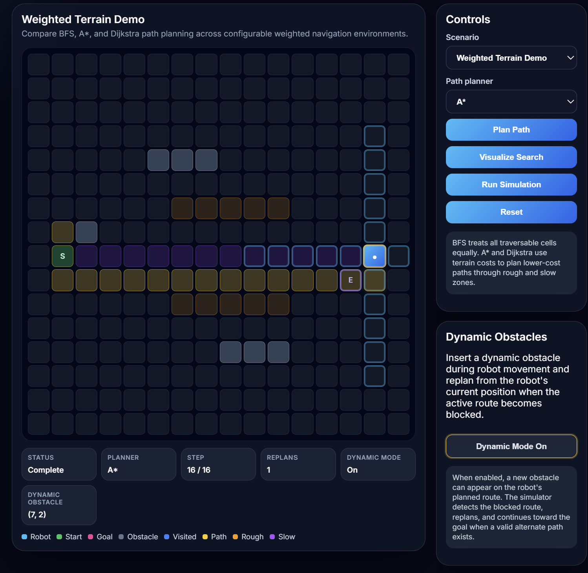
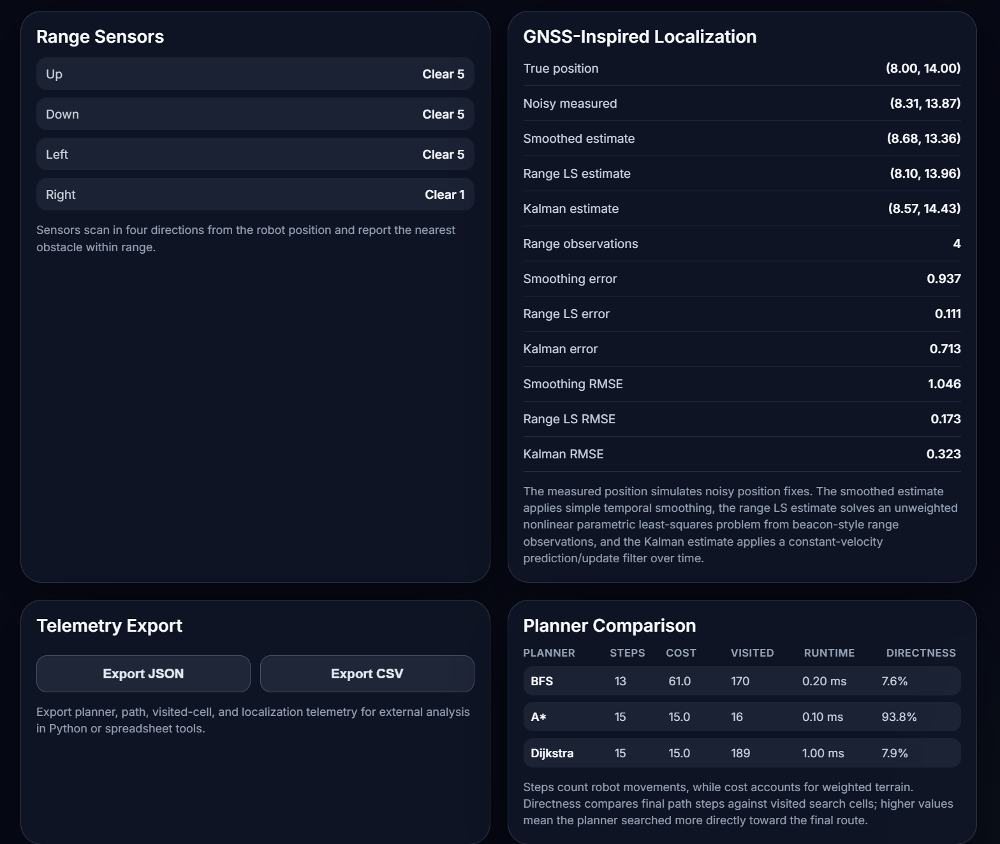

# Autonomy Simulation Lab


Replay recorded sensing data, compare processing configurations and inspect
changed frames alongside timing and spatial context. A separate browser simulator
explores planning and localization with synthetic measurements.

[Live simulator](https://kushrishi.github.io/autonomy-simulation-lab/) ·
[Native walkthrough](native/INSTALLED_RECORDING_WORKFLOW.md) ·
[Roadmap](ROADMAP.md) · [MIT license](LICENSE)

## Choose a workflow

| Workflow | What you can do | Current status |
| --- | --- | --- |
| Native C++/Python replay | Verify frame/model identity, execute CPU inference, compare outputs and inspect an optional Rerun recording. | Installed 108-frame comparison completed; output-cleanup diagnosis, complete packet recovery and human desktop acceptance remain open. No native release is published. |
| Browser simulator | Compare grid planners, add obstacles, inspect noisy localization and export telemetry. | Released as [v1.0.0](https://github.com/Kushrishi/autonomy-simulation-lab/releases/tag/v1.0.0). |

## Native replay

The runner validates timestamps and consumed file bytes, decodes bounded PNG
images, applies an explicit preprocessing contract and executes a pinned ONNX
Runtime CPU model. Python tools compare per-frame predictions, missing or reordered
frames, configuration identity and latency. Optional Rerun export connects those
results with camera imagery, ENU positions and synchronization skew.

Start with [build/install and the included synthetic example](native/USABILITY.md).
Then follow the [installed recording-to-viewer workflow](native/INSTALLED_RECORDING_WORKFLOW.md)
for your authorized recording and compatible model. The model, viewer and dataset
have separate dependencies; this is not a one-command universal binary.

The [real-recording validation](native/INSTALLED_RECORDING_VALIDATION_2026_10_10.md)
covered all 108 original frames using a relocated installation. Both preprocessing
runs completed and the fresh baseline matched retained numerical outputs exactly.
Candidate output residue was subsequently observed and preserved; the comparison
now flags residue after process exit. Its original cause remains unresolved.

See [release acceptance](native/RELEASE_READINESS_2026_10.md) for the remaining
requirements. Same-host repeatability and changed predictions do not establish
perception accuracy, sensor fusion or cross-platform determinism.

## Browser simulator



Run BFS, A* or Dijkstra on an editable grid, introduce obstacles during movement
and inspect replanning. BFS minimizes step count on an unweighted grid; A* and
Dijkstra share terrain-weighted costs. A* uses a Manhattan-distance heuristic.

Compare simulated truth with noisy position measurements, Gauss-Newton range
least-squares estimates and a constant-velocity Kalman filter. The Kalman filter
uses position observations; it does not directly fuse nonlinear beacon ranges.
This is an educational model, not a GNSS receiver or autonomous vehicle stack.



Export JSON/CSV telemetry for [Python analysis](analysis/README.md).
Tests cover planner correctness, weighted optimality, replanning helpers, input
validation, range recovery and filter behavior. CI runs tests and build checks.

From a checkout:

```bash
npm ci
npm test
npm run build
npm run dev
```

Open `http://localhost:5173/autonomy-simulation-lab/`.
On Windows PowerShell, use `npm.cmd` if script-execution policy blocks `npm`.

## Repository guide

- [Native contracts and build options](native/README.md)
- [Recording acquisition](native/ACQUISITION.md)
- [Spatial adapters](native/SPATIAL_ADAPTERS.md)
- [Model and preprocessing contracts](native/INFERENCE.md)
- [Direction and completion criteria](ROADMAP.md)

The source is MIT licensed. Dataset and model terms remain separate; private
recordings are not distributed in this repository.
