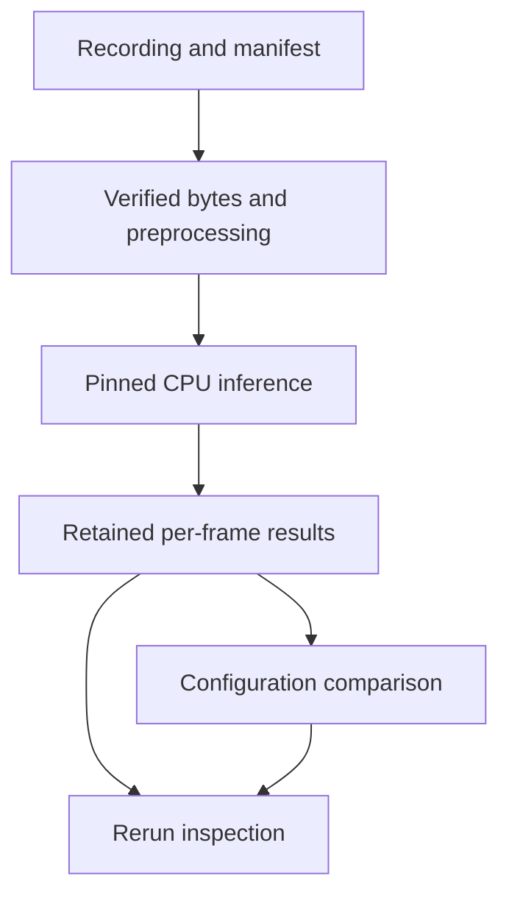

# Architecture

The browser simulator and native replay share an interest in inspecting sensing
behavior, but they have separate inputs, implementations and validation records.
Neither calls the other.

| Area | Implementation | Data and result |
| --- | --- | --- |
| Browser orchestration | `src/App.tsx`, `src/components/` | Scenario editing, stepping, panels and export |
| Planning | `src/planning/`, `src/simulation/terrain.ts` | BFS step-count baseline; A*/Dijkstra terrain-weighted routes |
| Localization | `src/localization/`, `src/sensors/` | Synthetic observations, range least squares and a position/velocity Kalman filter |
| Browser export | `src/telemetry/`, `analysis/` | Versioned JSON and CSV; offline plots and planner summaries |
| Native input | `native/src/replay_manifest.cpp`, `frame_files.cpp`, `sha256.cpp` | Ordered manifest and verified bounded frame/model bytes |
| Decode and preprocessing | `native/src/png_decode.cpp`, `preprocess*.cpp` | RGB8 buffers and explicit float32 tensor contracts |
| Inference | `native/src/inference.cpp` | Pinned ONNX Runtime CPU; one input/output; per-frame JSONL |
| Execution and comparison | `native/tools/compare_configurations.py`, `compare.py` | Two explicit executions, identity/numerical differences and measured latency |
| Spatial and viewer adapters | `native/tools/kitti_adapter.py`, `rerun_adapter.py` | Authorized recording import, ENU/skew metadata and optional Rerun export |

## Native data flow

Model and recording hashes identify consumed bytes. Per-frame latency excludes
process startup and serialization; whole-command wall time includes them.
Comparison separates identity changes from numerical differences and missing or
reordered frames. Spatial metadata is displayed alongside image-model outputs;
it is not fused into those predictions.

## Tests and remaining limits

Browser tests cover planning, estimation, imported scenarios and telemetry.
Native tests cover malformed manifests, file identity, bounded decoding,
preprocessing against Python references, inference and relocated installation.
The included model is a synthetic arithmetic fixture. CI does not contain private
recordings or replace human desktop acceptance.

The browser's main component still owns several related state transitions.
Extract a component or hook when a concrete change needs an independently
understandable lifecycle; a broad rewrite is unnecessary for native delivery.
Current output-cleanup and artifact-recovery work is tracked in the
[roadmap](../ROADMAP.md), with dated evidence in
[native release acceptance](../native/RELEASE_READINESS_2026_10.md).
